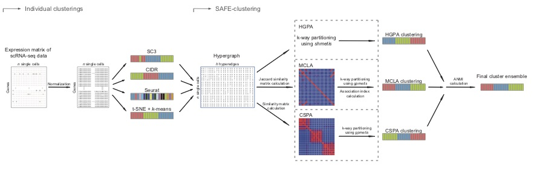
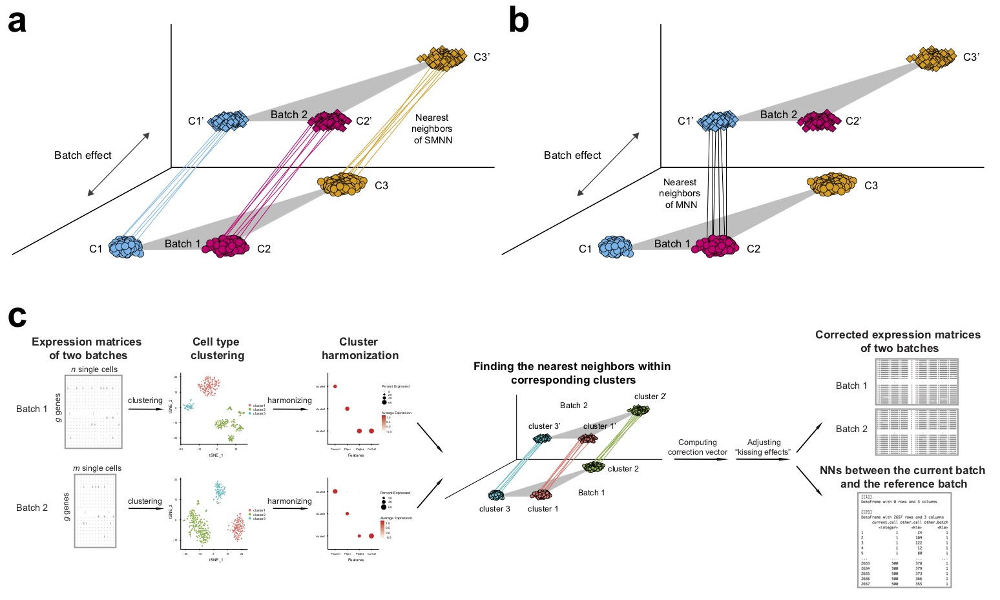

### Aggregated Clustering Method for Single-cell RNA-seq Data

I developed SAFE-clustering and SAME-clustering, a flexible, accurate and robust method for single-cell aggregated (From Ensemble) clustering. SAFE and SAME both build a consensus clustering solution from solutions of multiple types of individual clustering methods, including SC3, CIDR, Seurat and t-SNE + k-means. SAFE performs ensemble clustering using three hypergraph-based partitioning algorithms, and SAME applies EM algorithm in ensemble step.

Our analyses revealed that both SAFE and SAME provided the most accurate or closest match to the most accurate clustering solutions across benchmarking datasets with varying technologies, number of single cells and level of heterogeneity across single cells. SAME also allows additional flexibility, enjoys statistical rigor by employing a mixture model framework and demonstrates superior performance over 15 benchmark datasets.

Details of these works can be found at <a href="https://academic.oup.com/bioinformatics/article-abstract/35/8/1269/5092931"><i>Yang et al., 2019, Bioinformatics</i></a> and <a href="https://academic.oup.com/nar/article/48/1/86/5644992"><i>Huh et al., 2020, Nucleic Acids Research</i></a>.

    

        

        
        

    

---

### Batch Effect Correction for scRNA-seq data via Supervised Mutual Nearest Neighbor (SMNN) Detection

Batch effect correction has been recognized to be indispensable when integrating scRNA-seq data from multiple batches. A recent study proposed an effective batch effect correction method based on mutual nearest neighbors (MNN) across batches. However, the original MNN method is unsupervised in that it ignores cluster label information of single cells, which has the potential to further improve effectiveness of batch effect correction, particularly under realistic scenarios where true biological differences are not orthogonal to batch effect. Therefore, I propose SMNN for batch effect correction of scRNA-seq data via supervised mutual nearest neighbor detection. Our extensive evaluations in simulated and real datasets show that SMNN provides improved merging within the corresponding cell types across batches, leading to reduced differentiation across batches over MNN, Seurat v3, and LIGER. Furthermore, SMNN retains more cell type-specific features, partially manifested by differentially expressed genes identified between cell types after SMNN correction being biologically more relevant.

Details of SMNN can be found at <a href="https://academic.oup.com/bib/article-abstract/doi/10.1093/bib/bbaa097/5855265?redirectedFrom=fulltext"><i>Yang et al., 2020, Briefings in Bioinformatics</i></a>.

    

        

        
        

    

